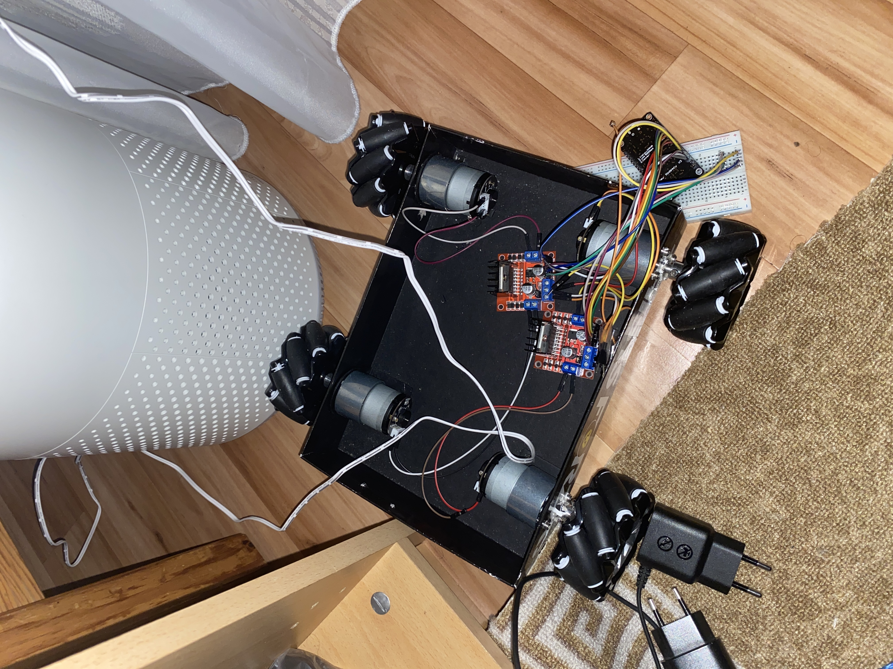

# Blynk ESP32 Servo & DC Motor Controller

This project allows you to control a DC Motor (bi-directional) and a Servo motor remotely over Wi-Fi using an ESP32 and the Blynk IoT platform (using the Blynk.Edgent provisioning). 

<p align="center">
  
</p>

### Hardware Setup
<p align="center">
  
</p>

## 🛠 Hardware Components
* ESP32 Development Board
* Servo Motor (e.g., SG90 or MG995) connected to GPIO 5
* DC Motor Module (connected to GPIO 12 & 13, likely via an L298N motor driver)
* Jumper Wires & Power Supply

## ⚙️ Features
1. **DC Motor Control:** Control the rotation direction of the DC Motor (Clockwise / Anti-Clockwise).
2. **Servo Pre-sets:** Quick buttons to command the servo to specific positions: "Hold" (180°) and "Release" (20°).
3. **Variable Servo Control:** Fine-tune the servo motor to a specific angle.
4. **Blynk Edgent Integration:** Seamless Wi-Fi provisioning and Over-The-Air (OTA) updates using the Blynk App.

## 📱 Blynk App Configuration (Virtual Pins)
* **V1:** DC Motor Clockwise
* **V2:** DC Motor Anti-Clockwise
* **V3:** Servo Hold (180 degrees)
* **V4:** Servo Release (20 degrees)
* **V5:** Servo Variable Angle Input

## 🚀 How to Use
1. Open up `Edgent_ESP32.ino` via the Arduino IDE.
2. Replace your **Blynk Template ID** and **Device Name** at the top of the file:
   ```cpp
   #define BLYNK_TEMPLATE_ID "YOUR_TEMPLATE_ID"
   #define BLYNK_DEVICE_NAME "YOUR_DEVICE_NAME"
   ```
3. Ensure the ESP32 Servo library is installed.
4. Compile, flash to the ESP32 board, and use the Blynk Mobile app to configure its Wi-Fi credentials.
